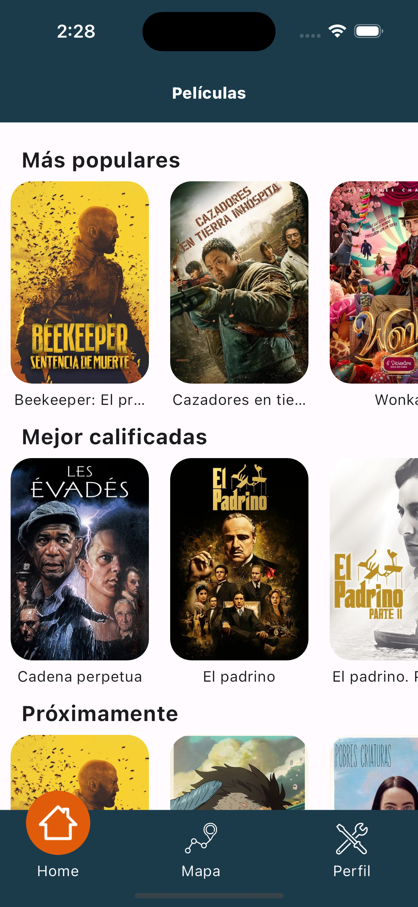
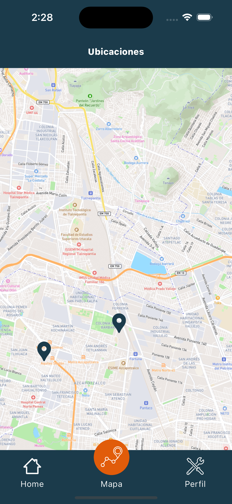
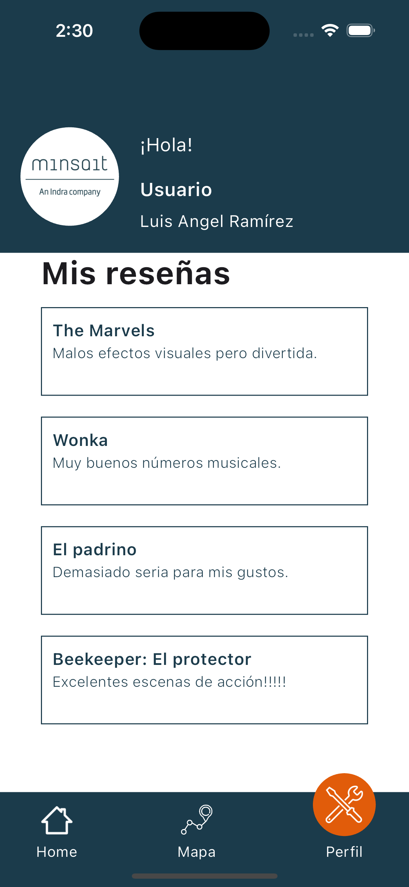

# Prueba técnica Luis Ramírez

La app consta de 3 modulos:
-  Listado de peliculas (home.dart)
    -  Utiliza The Movie Database API
    -  
    -  
-  Mapa de Ubicaciones (map.dart)
    - Con ubicaciones específicas
    -  
-  Perfil (map.dart)
    - Con información de usuario
    - Reseñas (estás se crean al seleccionar una película del listado).
    - 

 
## Versiones
-  Flutter 3.16.9
-  Dart 3.2.6

## Decisiones de diseño

- Para administrar el estado global de la aplicación ocupé el patrón Provider, por su popularidad y simplicidad sobre Bloc. 

- Para la persistencia de datos use el plugin sqflite que permite rápidas inserciones y consultas de una base de datos.

